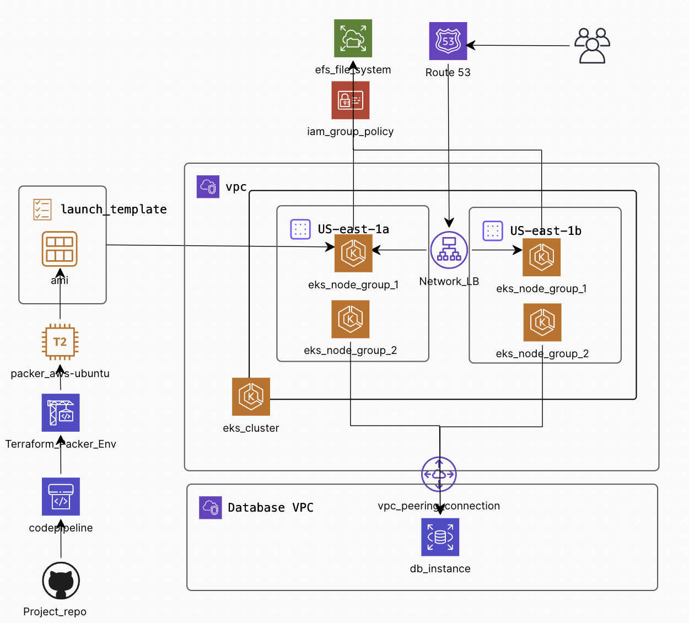

## Project Description
A simple EKS deployment utilizing Terraform modules by [Anton Babenko](https://registry.terraform.io/namespaces/antonbabenko) is designed to deploy sets of frontend and backend worker nodes across multiple availability zones for fault tolerance. It also includes provisioning of an EFS drive to preserve state. 

The concept can be easily extended to include a database in a different VPC, which can be connected using VPC peering, ensuring that the worker nodes have the necessary permissions to access the database. 

Additionally, a sample CI/CD pipeline has been demonstrated, which utilizes Packer to generate the latest AMI on each push to the master branch. Remaining code testing can be effectively implemented through GitHub Actions

## Repo Design
```
.
├── docs 									# Project Documentation
│ └── ...
├── iac 									# Terraform Config modules
└── README.md

```

## Architecture Diagram



### Sources Reffered
1. [Terraform EKS Module](https://registry.terraform.io/modules/terraform-aws-modules/eks/aws/latest) By Anton Babenko
2. [Terraform VPC Module](https://registry.terraform.io/modules/terraform-aws-modules/vpc/aws/latest) By Anton Babenko
4. [Terraform EFS Module](https://registry.terraform.io/modules/terraform-aws-modules/efs/aws/latest) By Anton Babenko
5. [Creating and Managing Mount Targets](https://docs.aws.amazon.com/efs/latest/ug/accessing-fs.html)
6. [Managing Applications with Amazon EKS](https://docs.aws.amazon.com/architecture-diagrams/latest/modernize-applications-with-microservices-using-amazon-eks/modernize-applications-with-microservices-using-amazon-eks.html)